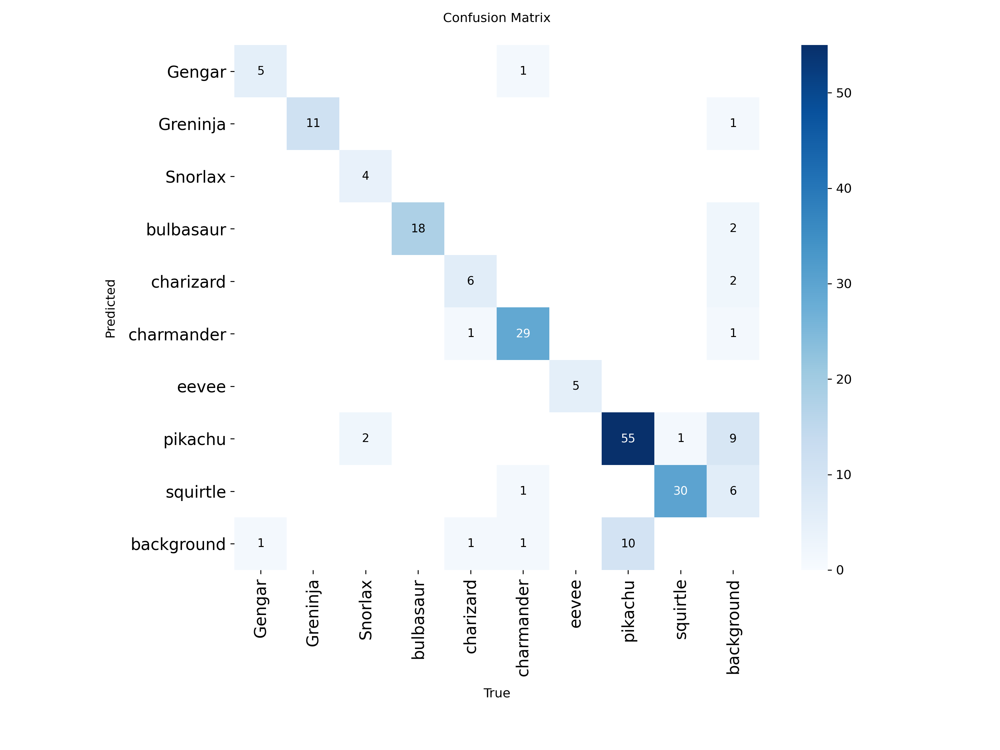
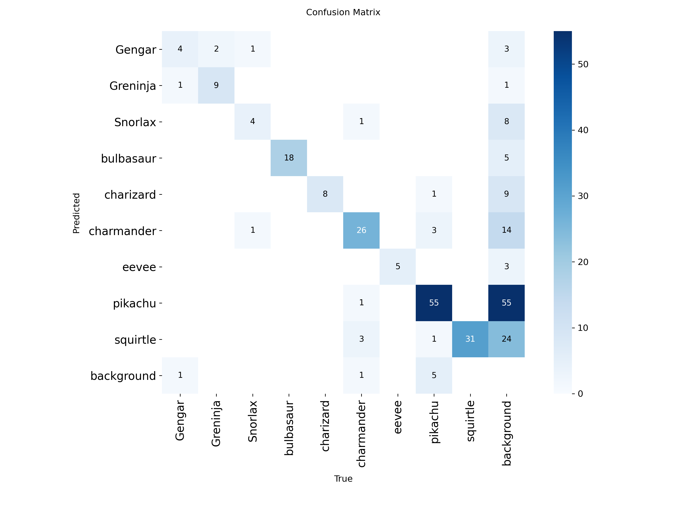
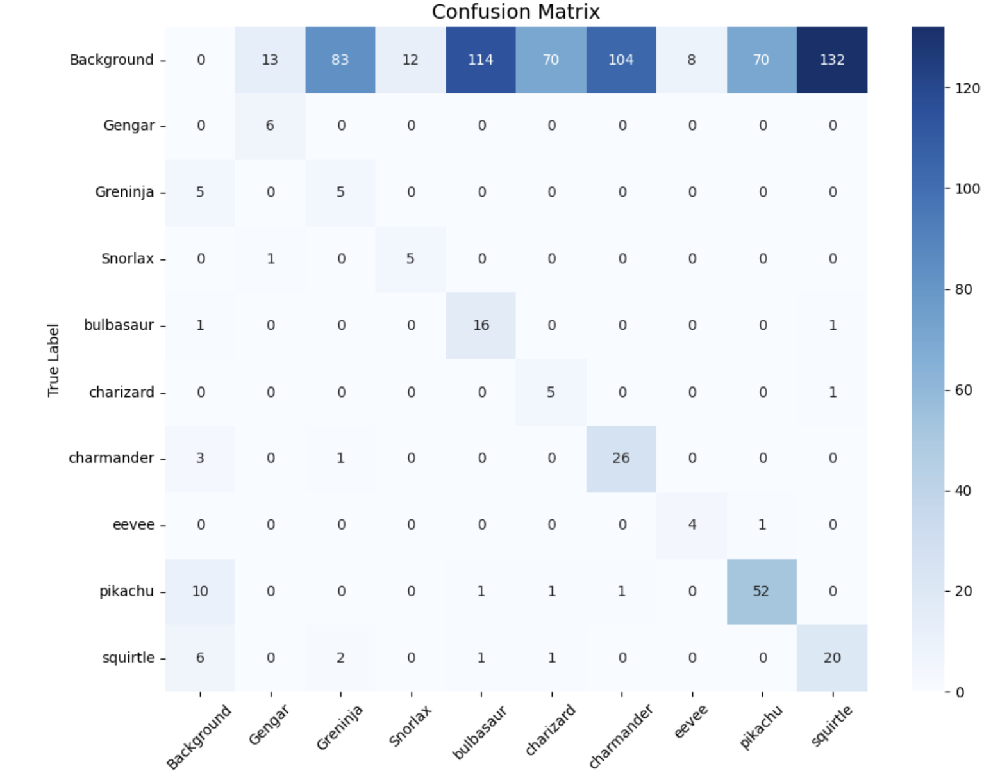

# Gotta Detect 'Em All: Real-Time Pokemon Detection

This project presents a comparative study of object detection architectures applied to stylized video tracking. We evaluated **YOLOv11s**, **RT-DETR**, and **Faster R-CNN** on a balanced dataset of 9 Pokémon classes.

The study analyzes the trade-offs between inference speed, geometric localization quality, and classification precision to determine the optimal architecture for non-photorealistic domains.


<br>
*(Real-time tracking comparison: YOLOv11s providing stable detection)*

## 1. Performance Benchmarks

All models were trained and evaluated on an **NVIDIA T4 GPU (16GB VRAM)** using a standardized input resolution of **640x640**.

### Classification & Speed Efficiency
**YOLOv11s** proves to be the superior architecture for real-time applications. It achieves the highest F1-Score (0.8943) with an inference time of just **10.99 ms**, making it approximately 8x faster than the two-stage baseline.

| Model | Precision | Recall | F1 Score | Inference Time |
| :--- | :--- | :--- | :--- | :--- |
| **YOLOv11s** | **0.9437** | **0.8499** | **0.8943** | **10.99 ms** |
| RT-DETR | 0.8948 | 0.7905 | 0.8073 | 34.27 ms |
| Faster R-CNN | 0.1836 | 0.7898 | 0.2980 | 88.29 ms |

### Localization Quality (Geometric Accuracy)
While Faster R-CNN performs poorly in classification (high false positives), its Region Proposal Network (RPN) achieves the best geometric alignment on correctly identified objects. It slightly outperforms the single-stage regressors in terms of IoU metrics.

| Model | mAP 50-95 |
| :--- | :--- |
| **Faster R-CNN** | **0.7976** |
| YOLOv11s | 0.7871 |
| RT-DETR | 0.7387 |

---

## 2. Visual Analysis & Error Modes

### Precision-Recall Analysis
The graph below highlights the significant performance gap. **YOLOv11s (Green)** and **RT-DETR (Red)** maintain high precision across all recall levels. In contrast, the **Faster R-CNN (Blue)** curve suffers a sharp drop, indicating a high rate of false positives where the model mistakes background elements for Pokémon.


### Confusion Matrices Comparison
By analyzing the confusion matrices side-by-side, we can pinpoint the specific failure modes of each architecture:

| YOLOv11s | RT-DETR | Faster R-CNN |
| :---: | :---: | :---: |
|  |  |  |
| **Clean Diagonal**<br>Shows robust class separation. The model rarely confuses different Pokémon species. | **Scattered Errors**<br>Shows a more diffuse error pattern among morphologically similar classes (e.g., Charmander/Charizard). | **Background Noise**<br>The top row is heavily populated, confirming the model frequently "hallucinates" objects in empty space. |

### Qualitative Results (YOLOv11s)
Below are detection samples from the best-performing model on the validation batch. The bounding boxes are tight, and confidence scores remain high even for stylized artwork and varying poses.


---

## 3. Methodology

### Dataset & Augmentation
We utilized a dataset from Roboflow Universe containing **9 distinct classes**. To mitigate the initial class imbalance (e.g., 280 images for Pikachu vs. only 22 for Eevee), we implemented a rigorous synthetic augmentation pipeline:

* **Classes:** Gengar, Greninja, Snorlax, Bulbasaur, Charizard, Charmander, Eevee, Pikachu, Squirtle.
* **Balancing Strategy:** The training set was augmented to reach exactly **280 images per class**.
* **Techniques:** Geometric transformations (rotation, flips) and pixel-level adjustments (blur, brightness).

### Architectures & Training Strategies
* **YOLOv11s:** A single-stage CNN. We employed a **Frozen Backbone strategy (first 10 layers)** to preserve domain-agnostic features and prevent overfitting on the stylized dataset.
* **RT-DETR:** A Transformer-based architecture using self-attention mechanisms to capture global context.
* **Faster R-CNN (ResNet50):** A traditional two-stage detector. We performed **Full Fine-Tuning** to adapt the deep feature extractors to the non-photorealistic domain.

---

## 4. Usage

### Installation
Clone the repository and install the required dependencies:
```bash
git clone [https://github.com/ricca200xx/Pokemon-Detection-Model-Comparison.git](https://github.com/ricca200xx/Pokemon-Detection-Model-Comparison.git)
cd Pokemon-Detection-Model-Comparison
pip install -r requirements.txt
```
## 5. Inference
Due to file size limits, trained models are hosted in the Releases section.

1. **Download Weights:**
   Go to the **Releases v1.0** page and download:
   * `yolov11s_pokemon.pt` (Recommended for real-time)
   * `rtdetr_pokemon.pt`
   * `fasterrcnn_resnet50.pth`

2. **Run Detection:**
   Use the provided script in the `scripts/` directory or run via command line:
   ```bash
   python scripts/detect.py --weights yolov11s_pokemon.pt --source your_video.mp4
